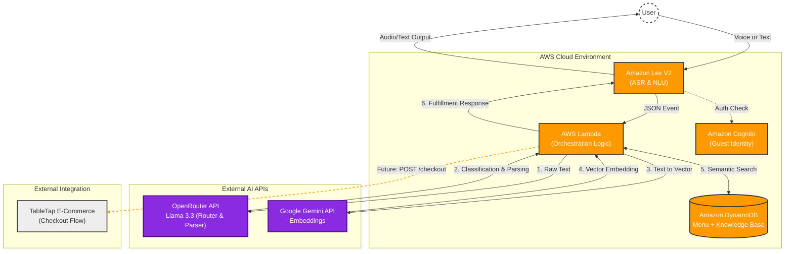
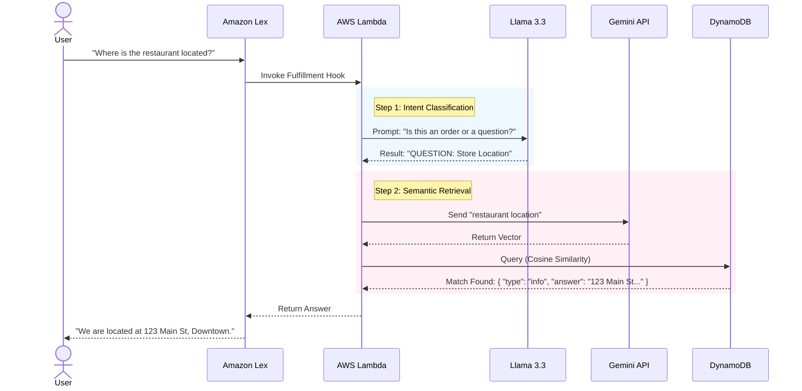

# TableAI: Serverless Generative AI Ordering System

**TableAI** is a fully serverless, event-driven conversational agent designed to streamline restaurant operations. Unlike rigid, rule-based chatbots, TableAI leverages **Large Language Models (LLMs)** and **Vector Embeddings** to perform two critical functions:
1.  **Complex Ordering:** Handling natural language, multi-item orders, and modifications.
2.  **Intelligent Q&A:** Answering customer inquiries (e.g., store hours, location, policies) using semantic search.

Built entirely on **AWS** using **Terraform**, this project demonstrates modern cloud-native architecture patterns including **Hybrid Search** and **Vector-Based Knowledge Retrieval**.

---

## 🏗 System Architecture

This system follows a serverless microservices pattern, utilizing **Amazon Lex** for state management and **AWS Lambda** for orchestration, while offloading cognitive tasks to specialized AI models via API.

🧠 The AI Pipeline: How it Works
TableAI utilizes a "Router-Retriever-Generator" pattern. When a user speaks, the backend logic dynamically switches between Order Fulfillment and Knowledge Retrieval.

🧠 The AI Pipeline: How it Works
TableAI utilizes a "Router-Retriever-Generator" pattern. When a user speaks, the backend logic dynamically switches between Order Fulfillment and Knowledge Retrieval.
code
Mermaid
sequenceDiagram
    actor User
    participant Lex as Amazon Lex
    participant Lambda as AWS Lambda
    participant LLM as Llama 3.3
    participant Embed as Gemini API
    participant DB as DynamoDB

    User->>Lex: "Where is the restaurant located?"
    Lex->>Lambda: Invoke Fulfillment Hook
    
    rect rgb(240, 248, 255)
    note right of Lambda: Step 1: Intent Classification
    Lambda->>LLM: Prompt: "Is this an order or a question?"
    LLM-->>Lambda: Result: "QUESTION: Store Location"
    end

    rect rgb(255, 240, 245)
    note right of Lambda: Step 2: Semantic Retrieval
    Lambda->>Embed: Send "restaurant location"
    Embed-->>Lambda: Return Vector
    Lambda->>DB: Query (Cosine Similarity)
    DB-->>Lambda: Match Found: { "type": "info", "answer": "123 Main St..." }
    end

    Lambda-->>Lex: Return Answer
    Lex-->>User: "We are located at 123 Main St, Downtown."
1. Intent Classification (Llama 3.3)
The raw user text is first processed by Llama 3.3 with a specific system prompt. The model determines if the user is attempting to purchase items or request information.
2. Vector-Based Knowledge Retrieval
We maintain a Knowledge Base in DynamoDB containing JSON items for store information (Address, Hours, Wi-Fi Policy, etc.). These items are pre-computed with vector embeddings.
If the user asks "Where are you guys at?", the system converts this to a vector using Gemini.
It performs a semantic search against the DynamoDB Knowledge Base.
Even though the phrasing is different from the stored key ("Store Address"), the vector proximity ensures the correct information is retrieved.
3. Contextual Ordering
If the intent is classified as an Order, the pipeline switches to parsing mode:
Extracts items and quantities to a strict JSON schema.
Performs semantic matching against the Menu items in DynamoDB (e.g., matching "Spicy Tuna" to "Volcano Roll").
🛠 Tech Stack
Cloud & Infrastructure
Cloud Provider: AWS
Infrastructure as Code: Terraform
CI/CD: GitHub Actions
Compute: AWS Lambda (Python 3.11)
Database: Amazon DynamoDB (Single Table Design with Vector Attributes)
Identity: Amazon Cognito (Identity Pools for unauthenticated guest access)
Artificial Intelligence
Orchestrator: Custom Python Logic
Reasoning & Routing: Llama 3.3 (via OpenRouter)
Embeddings: Google Gemini
Conversational Interface: Amazon Lex V2
✨ Core Features
Hybrid Q&A and Ordering: Seamlessly switches between taking complex food orders and answering general questions about the business within the same conversation.
Semantic Knowledge Base: Uses vector similarity to answer questions regardless of how the user phrases them (e.g., "When do you close?" vs "What are your hours?").
Zero-Friction Identity: Users interact immediately via guest credentials; no login or signup barriers.
Serverless Scalability: 100% serverless architecture means zero idle costs and automatic scaling during peak traffic.
Automated Deployments: Full CI/CD pipeline ensures that infrastructure and code changes are deployed safely and consistently.
🚀 Future Roadmap
🛒 TableTap Integration (E-Commerce)
The immediate next step is integrating with TableTap, an external e-commerce platform.
Checkout Workflow: Once the user confirms their order in Lex, Lambda will serialize the session data and trigger a POST request to TableTap's checkout API.
Payment Handoff: Users will be transitioned from the voice/chat interface to a secure web view to complete payment.
🤖 Advanced Personalization
Smart Suggestions: Use session history to suggest drink pairings or upsells based on the current basket.
User Retention: Recognize returning users via device fingerprints to offer "Quick Reorder" functionality.
