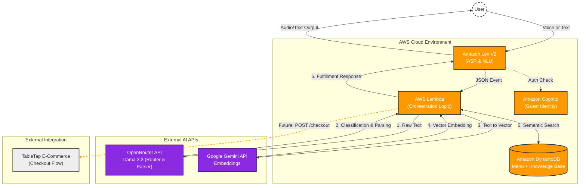

# TableAI: Serverless Generative AI Ordering System

**TableAI** is a fully serverless, event-driven conversational agent designed to streamline restaurant operations. Unlike rigid, rule-based chatbots, TableAI leverages **Large Language Models (LLMs)** and **Vector Embeddings** to perform two critical functions:
1.  **Complex Ordering:** Handling natural language, multi-item orders, and modifications.
2.  **Intelligent Q&A:** Answering customer inquiries (e.g., store hours, location, policies) using semantic search.

Built entirely on **AWS** using **Terraform**, this project demonstrates modern cloud-native architecture patterns including **Hybrid Search** and **Vector-Based Knowledge Retrieval**.

---

## 🏗 System Architecture

This system follows a serverless microservices pattern, utilizing **Amazon Lex** for state management and **AWS Lambda** for orchestration, while offloading cognitive tasks to specialized AI models via API.

🧠 The AI Pipeline: How it Works
TableAI utilizes a "Router-Retriever-Generator" pattern. When a user speaks, the backend logic dynamically switches between Order Fulfillment and Knowledge Retrieval.

    
